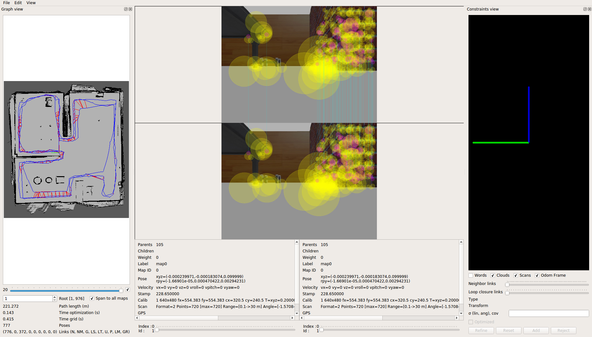

# Mappin-and-SLAM
Udacity Robotics Software Engineer Nanodegree Project 4

Step 1:Create map using maaping.launch file
Step 2:Save the created map
Step 3:For Localization launch Localization.launch file
